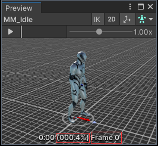

# [Won't Fix] Unity-Bug-Report-Playable-IN-44609

**Unity has stated that they will not fix this bug.**

> RESOLUTION NOTE:
Thank you for bringing this issue to our attention. Unfortunately, after careful consideration we will not be addressing your issue at this time, as we are currently committed to resolving other higher-priority issues, as well as delivering the new animation system. Our priority levels are determined by factors such as the severity and frequency of an issue and the number of users affected by it. However we know each case is different, so please continue to log any issues you find, as well as provide any general feedback on our roadmap page to help us prioritize.

## About this issue

The Animation Event will be triggered twice in certain situations.

Place the animation event on the first frame of the AnimationClip. At some point, connect the animation (an `AnimationClipPlayable`) to the mixer, then on the next frame, connect another animation to the mixer. This will trigger the issue.

## How to reproduce

1. Open the "Sample" scene.
2. Enter the Play mode.
3. In the Game view, click the "Perform" button.
4. In the Game view, observe the "Event Counter" text.

Expected result: The "Event Counter" value should be "1".

Actual result: The "Event Counter" value is "2".

## Solution

Do not add the AnimationEvent at the beginning of the AnimationClip.

You can still add the AnimationEvent at `frame 0` of the AnimationClip, but do not add it at `0% progress`.

